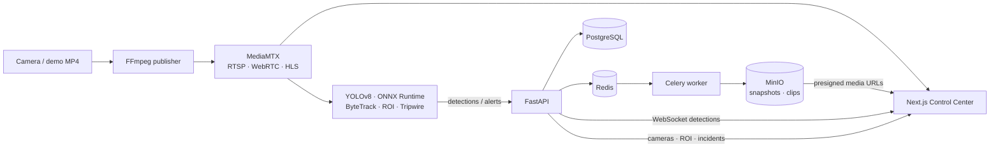

# VisionOps AI

<p align="center">
  <strong>Real-time computer vision operations platform for live monitoring, spatial rules, and incident response.</strong>
</p>

<p align="center">
  
  
  
  
  
  
</p>

<p align="center">
  
</p>

VisionOps AI turns live camera streams into operational events. It combines low-latency WebRTC playback, YOLO/ONNX inference, ByteTrack identity tracking, polygon ROI rules, tripwire counting, asynchronous media processing, and an incident-management dashboard in one Docker-based monorepo.

## Highlights

- **Low-latency live monitoring** through MediaMTX WebRTC/WHEP, with HLS and MP4 fallbacks.
- **Real-time detection overlay** synchronized with the rendered video and configurable latency compensation.
- **Stable object identities** using ByteTrack with Kalman-filtered boxes and short-occlusion recovery.
- **Multi-camera management** with camera CRUD, active/inactive state, location, and stream-path derivation.
- **Spatial analytics** with normalized polygon ROI zones and directional tripwires.
- **Incident lifecycle**: open, acknowledge, assign, comment, resolve, reopen, and immutable event history.
- **Alert evidence** with snapshots and clips processed asynchronously and stored in MinIO.
- **API security** using `X-API-Key`, including authenticated WebSocket access.
- **Versioned database schema** with Alembic migrations.
- **Automated quality gates** covering unit, API, tracking, build, and Playwright E2E tests.

## Product tour

### Live Monitor

WebRTC video and WebSocket detections share the same MediaMTX source. Bounding boxes are projected onto `object-contain` video geometry, while per-track velocity compensates for transport and inference delay.

<p align="center">
  
</p>

### Camera management

Register RTSP/HLS sources, edit metadata, disable cameras, and derive the MediaMTX path from each source URL.

<p align="center">
  
</p>

### ROI Polygon Editor

Draw resolution-independent intrusion zones. Coordinates are normalized before persistence and synchronized back to the inference engine.

<p align="center">
  
</p>

### Alert Gallery

Review evidence, filter incidents by camera/status, assign operators, add comments, resolve events, and inspect their history.

<p align="center">
  
</p>

## Architecture



### Components

| Component | Technology | Responsibility |
| --- | --- | --- |
| `visionops-engine` | Python, YOLOv8, ONNX Runtime, OpenCV, ByteTrack, Shapely | Detection, tracking, ROI and tripwire evaluation |
| `visionops-backend` | FastAPI, SQLAlchemy, Alembic, Celery | REST/WS API, persistence, lifecycle and media jobs |
| `visionops-ui` | Next.js 15, React 19, Tailwind CSS | Operations dashboard and canvas overlays |
| Streaming | MediaMTX, FFmpeg | RTSP ingest/publish, WebRTC/WHEP and HLS delivery |
| Data | PostgreSQL, Redis, MinIO | Relational data, task queue and object storage |
| Quality | Pytest, Ruff, Node Test Runner, Playwright | Unit, API, tracking and end-to-end validation |

## Quick start

### Prerequisites

- Docker Desktop with Docker Compose v2
- Git
- At least 8 GB RAM recommended for the first image build

Python 3.11+ and Node.js 20+ are only required for development outside Docker.

### Start the complete stack

```powershell
git clone <repository-url>
cd VisionOps_AI
Copy-Item .env.example .env
docker compose up -d --build
docker compose ps
```

The first engine build/install can take several minutes. The engine image explicitly uses **CPU-only PyTorch wheels** to avoid downloading CUDA runtime packages; production inference runs through ONNX Runtime.

### Open the services

| Service | URL |
| --- | --- |
| Control Center | [http://localhost:3000](http://localhost:3000) |
| API health | [http://127.0.0.1:8001/health](http://127.0.0.1:8001/health) |
| OpenAPI documentation | [http://127.0.0.1:8001/docs](http://127.0.0.1:8001/docs) |
| HLS demo stream | [http://127.0.0.1:8888/cam1/index.m3u8](http://127.0.0.1:8888/cam1/index.m3u8) |
| MinIO console | [http://127.0.0.1:9002](http://127.0.0.1:9002) |

The Compose stack contains nine services:

```text
mediamtx · publisher · postgres · redis · minio
backend · worker · engine · ui
```

### Useful operations

```powershell
# Follow application logs
docker compose logs -f backend worker engine ui publisher

# Rebuild application services after code changes
docker compose up -d --build backend worker engine ui

# Validate the demo stream
curl http://127.0.0.1:8888/cam1/index.m3u8

# Stop the stack
docker compose down
```

To reset all local database/object-storage volumes:

```powershell
# Destructive: removes local VisionOps data
docker compose down -v
```

## Runtime flow

1. The `publisher` service loops `visionops-engine/data/demo.mp4` into MediaMTX path `cam1`.
2. The browser receives that stream using WebRTC/WHEP.
3. The engine reads the same RTSP path, performs ONNX inference, and assigns stable ByteTrack IDs.
4. ROI/tripwire rules create alerts; detections are streamed to the UI through WebSocket.
5. Celery generates snapshot/clip evidence and uploads it to MinIO.
6. Operators process the incident from the Alert Gallery.

## Tracking and overlay synchronization

ByteTrack is enabled by default:

```powershell
cd visionops-engine
python demo_roi.py --tracker bytetrack `
  --track-low-thresh 0.10 `
  --track-high-thresh 0.25 `
  --track-buffer 30
```

The previous nearest-centroid tracker remains available for diagnostics:

```powershell
python demo_roi.py --tracker centroid
```

The frontend uses each `track_id` to estimate object velocity and compensate for residual video/detection latency. The Live Monitor exposes a latency slider for environment-specific fine tuning.

## Configuration

Copy `.env.example` to `.env`, then review at least:

```dotenv
VISIONOPS_API_KEY=visionops-dev-key
VISIONOPS_JWT_SECRET=visionops-dev-jwt-secret-change-me
VISIONOPS_ADMIN_USERNAME=admin
VISIONOPS_ADMIN_PASSWORD=visionops-admin
VIDEO_SOURCE=
CAMERA_NAME=demo-camera
YOLO_CONF=0.25
USE_ONNX=true
MINIO_PUBLIC_ENDPOINT=127.0.0.1:9001
```

The included values are for **local development only**. Use strong, externally managed secrets and HTTPS in production.

### Authentication

VisionOps supports dual authentication:

| Actor | Mechanism | Notes |
| --- | --- | --- |
| Engine / workers | `X-API-Key` or `?api_key=` | Service principal with admin-equivalent access |
| Humans (UI) | `Authorization: Bearer <JWT>` | Login at `/login`; roles `admin` / `operator` |
| Detection WebSocket | `?token=<JWT>` or `?api_key=` | Browsers cannot set custom headers |

- `/health` and `GET /api/v1/auth/status` remain public.
- **admin**: camera CRUD, user creation (UI `/users`), alert delete, full incident workflow.
- **operator**: read cameras/monitor/ROI, run incident workflow; no camera CRUD or user management.
- On first boot with `VISIONOPS_JWT_SECRET` set and an empty `users` table, the backend creates the bootstrap admin (`admin` / `visionops-admin` by default).

### Observability

Prometheus scrapes:

| Target | URL |
| --- | --- |
| Backend | `http://127.0.0.1:8001/metrics` |
| Engine | `http://127.0.0.1:9101/metrics` |
| Prometheus UI | [http://127.0.0.1:9090](http://127.0.0.1:9090) |
| Grafana | [http://127.0.0.1:3001](http://127.0.0.1:3001) (default `admin` / `admin`) |

Key series: `visionops_engine_fps`, `visionops_engine_infer_ms`, `visionops_engine_stream_up`, `visionops_engine_reconnects_total`, `visionops_http_request_duration_seconds`, `visionops_alerts_created_total`, `visionops_celery_queue_depth`.

The **VisionOps Overview** dashboard is provisioned automatically under the VisionOps folder in Grafana.

### RTSP resilience

The engine wraps live sources (`rtsp://`, `http://`, …) in `RobustCapture`:

- Retries the initial open with exponential backoff
- Reconnects after consecutive failed reads (does not exit the process)
- File sources still stop at EOF (no reconnect loop)

Tunables: `RTSP_RECONNECT`, `RTSP_RECONNECT_INITIAL`, `RTSP_RECONNECT_MAX`, `RTSP_FAIL_THRESHOLD`, `RTSP_OPEN_RETRIES`.

### Multi-camera scale

By default (`ENGINE_MODE=multi`) the engine container runs `multi_cam_runner.py`:

1. Polls `GET /api/v1/cameras?active_only=true` every `CAMERA_POLL_SECONDS`
2. Starts one `demo_roi.py` subprocess per active camera (`source_url` + `name`)
3. Restarts workers when a source URL changes or a process crashes
4. Falls back to `VIDEO_SOURCE` + `CAMERA_NAME` when the API has no cameras yet

Set `ENGINE_MODE=single` for the legacy single-stream process. Add cameras in the UI (`/cameras`) to scale inference without rebuilding images.

When the engine runs in Docker, set each camera `source_url` to a container-reachable host (e.g. `rtsp://mediamtx:8554/cam1`), not `127.0.0.1`.

### Notifications

Configure one or more channels in `.env` (empty = disabled). Delivery runs asynchronously on the Celery worker.

| Channel | Variables |
| --- | --- |
| Generic webhook | `NOTIFY_WEBHOOK_URL` — JSON POST with `event_type`, alert fields, `dashboard_url` |
| Slack | `NOTIFY_SLACK_WEBHOOK_URL` — Incoming Webhook |
| Email | `NOTIFY_EMAIL_TO` + `NOTIFY_SMTP_HOST` (+ optional user/password/TLS) |

`NOTIFY_EVENTS` defaults to `created,resolved` (use `all` for every lifecycle event).  
Status: `GET /api/v1/notifications/status` (authenticated).

### Retention and storage quotas

Automatic Celery Beat job (service `beat`) applies three policies:

1. **Media age** — delete MinIO snapshots/clips for alerts older than `RETENTION_MEDIA_DAYS` (default 30).
2. **Resolved incidents** — delete resolved alert rows (+ media) older than `RETENTION_RESOLVED_ALERT_DAYS` (default 90).
3. **Bucket quota** — if `alerts/` usage exceeds `RETENTION_BUCKET_QUOTA_MB` (default 5120), delete oldest objects until under quota.

| Endpoint | Access |
| --- | --- |
| `GET /api/v1/retention/status` | Authenticated |
| `POST /api/v1/retention/run?dry_run=true&async_run=false` | Admin |

### Database migrations

The backend automatically runs `alembic upgrade head` during startup.

```powershell
cd visionops-backend
.\.venv\Scripts\Activate.ps1

alembic current
alembic upgrade head
alembic revision --autogenerate -m "describe schema change"
```

## API overview

| Area | Main endpoints |
| --- | --- |
| Auth | `POST /api/v1/auth/login`, `GET /me`, `GET/POST /users`, `GET /status` |
| Metrics | `GET /metrics` (Prometheus text), engine `:9101/metrics` |
| Notifications | `GET /api/v1/notifications/status` |
| Retention | `GET /api/v1/retention/status`, `POST /api/v1/retention/run` |
| Cameras | `GET/POST /api/v1/cameras`, `PATCH/DELETE /api/v1/cameras/{id}` |
| ROI zones | `GET/POST /api/v1/roi-zones`, `DELETE /api/v1/roi-zones/{id}` |
| Detections | `POST /api/v1/detections`, `GET /api/v1/detections/latest` |
| Live detections | `WS /api/v1/ws/detections` |
| Alerts | `GET/POST /api/v1/alerts`, `GET/DELETE /api/v1/alerts/{id}` |
| Incident workflow | `acknowledge`, `assign`, `comments`, `resolve`, `reopen`, `events` |

See the interactive OpenAPI documentation at [http://127.0.0.1:8001/docs](http://127.0.0.1:8001/docs).

## Development

### Engine

```powershell
cd visionops-engine
py -3.11 -m venv .venv
.\.venv\Scripts\Activate.ps1
pip install -r requirements.txt

python demo_roi.py --skip-benchmark --max-frames 0 `
  --source rtsp://127.0.0.1:8554/cam1 `
  --stream-detections --post-alerts --sync-roi `
  --api-url http://127.0.0.1:8001 `
  --api-key visionops-dev-key
```

### Backend and worker

```powershell
cd visionops-backend
py -3.11 -m venv .venv
.\.venv\Scripts\Activate.ps1
pip install -r requirements.txt

uvicorn app.main:app --reload --host 127.0.0.1 --port 8001

# Run in a second PowerShell terminal
celery -A app.celery_app.celery_app worker --loglevel=info --pool=solo
```

### UI

```powershell
cd visionops-ui
Copy-Item .env.local.example .env.local
npm install
npm run dev
```

## Testing

The current validation baseline is:

- **Engine:** 23 tests — ByteTrack, ROI/tripwire, ONNX, RTSP reconnect, multi-cam supervisor
- **Backend:** 20 tests — API auth, migrations, camera/alert lifecycle
- **UI:** 15 unit tests — WHEP security, geometry, stream paths, overlay sync
- **E2E:** 3 Playwright scenarios — camera CRUD, ROI CRUD, incident workflow

### Run locally

```powershell
# Engine
cd visionops-engine
.\.venv\Scripts\python.exe -m pytest tests -q

# Backend
cd ..\visionops-backend
.\.venv\Scripts\python.exe -m pytest tests -q

# UI unit/type checks
cd ..\visionops-ui
npm run test:unit
npx tsc --noEmit

# Playwright against the running Docker stack
npm run test:e2e:install
npm run test:e2e
```

GitHub Actions runs engine lint/tests, backend API tests, UI unit/type/build checks, and Playwright Chromium against a disposable Docker stack. Failed E2E runs retain screenshots, video, traces, and an HTML report.

## Repository layout

```text
VisionOps_AI/
├── .github/workflows/ci.yml
├── deploy/
│   ├── grafana/
│   └── prometheus/
├── docker/
├── docs/screenshots/
├── scripts/
├── visionops-backend/
│   ├── alembic/
│   ├── app/
│   └── tests/
├── visionops-engine/
│   ├── byte_tracker.py
│   ├── demo_roi.py
│   └── tests/
├── visionops-ui/
│   ├── app/
│   ├── components/
│   ├── e2e/
│   └── lib/
├── docker-compose.yml
└── .env.example
```

## Project status

- [x] ONNX detection pipeline
- [x] MediaMTX WebRTC/HLS streaming
- [x] Multi-camera CRUD and selection
- [x] ROI and tripwire rules
- [x] ByteTrack identity tracking
- [x] Video/overlay latency compensation
- [x] Alert evidence in MinIO
- [x] Incident lifecycle and history
- [x] Alembic migrations
- [x] API-key authentication and WHEP target hardening
- [x] Unit/API/E2E CI pipeline
- [x] User accounts, JWT, and role-based access control
- [x] Prometheus/Grafana observability
- [x] Notification integrations (email/webhook/Slack)
- [x] Retention policies and storage quotas
- [x] RTSP reconnect / stream resilience
- [x] Multi-camera engine scaling (one worker per camera)

